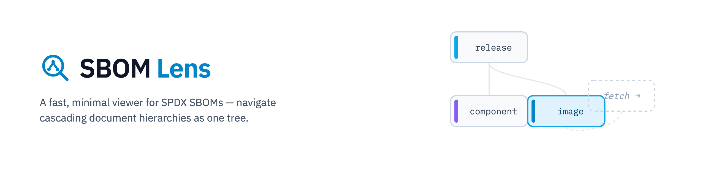
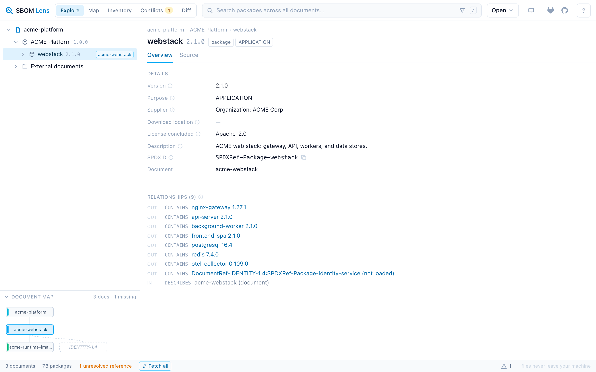

# SBOM Lens

Drop a release-level SPDX document plus its component SBOMs and navigate the whole
supply chain as one tree: release → component → sub-component → container image →
package. Everything runs in your browser; files never leave your machine.

**Try it:** <https://sbom-lens.everbright-it.de/app/> — the project landing
page lives at <https://sbom-lens.everbright-it.de/>. The VS Code extension is
on [Open VSX](https://open-vsx.org/extension/everbright-it/sbomlens).



<sub>Regenerate with `npm run screenshot -w @sbomlens/web` (dev server running).</sub>

## Why SBOM Lens

- **Cascading documents are first-class.** SPDX 2.3 links documents via
  `ExternalDocumentRef` and cross-document relationships
  (`DocumentRef-X:SPDXRef-Y`). SBOM Lens resolves those references across every
  file you load — by checksum first, then namespace — and renders one continuous,
  lazily-expanded tree across document boundaries. Unresolved references appear as
  actionable placeholders: fetch them by URL, drop the file, or confirm a
  suggested match.
- **Fast at real-world scale.** Multi-megabyte documents (6,500+ packages) parse
  in a Web Worker; the tree and source views are virtualized; search runs against
  a prebuilt index with ranked results. No pagination, no jank.
- **Private by design.** A static, client-only app. SBOMs are parsed locally and
  never uploaded. URL fetching only happens when you explicitly ask for it.
- **Honest about dirty data.** Real SBOMs have quirks — checksum spacing variants,
  duplicate SPDXIDs, references without relationships, unknown relationship
  types, versions hiding in purls. The parser tolerates all of it and reports
  what it found as per-document diagnostics instead of refusing to load.
- **Answers questions, not just files.** Beyond browsing: an exportable
  cross-cascade inventory, version-conflict detection, release-to-release
  diffs, and a per-document NTIA quality report.

## Quick start

```sh
git clone https://gitlab.com/everbrightit-group/sbom-lens.git
cd sbom-lens
npm ci
npm run dev      # → http://localhost:5173
```

Click **Load example** for a bundled four-document demo cascade, or drop your own
`.spdx` / `.spdx.json` files (multi-select and whole folders work).

## Loading documents

| Method | Notes |
| --- | --- |
| Drag & drop | Anywhere in the window; folders are walked recursively |
| Open ▸ Files / Folder | Standard pickers |
| Open ▸ From URL | Fetches a document over HTTP(S), e.g. from a GitLab generic package registry |
| Placeholder ▸ Fetch | Each unresolved reference offers a one-click fetch of its recorded URL |
| **Fetch all** (status bar) | Downloads every referenced document **recursively** until the cascade is complete — one click for the full tree instead of one per placeholder |

**Access tokens:** for private registries, add a per-host token in the URL dialog
(GitLab `PRIVATE-TOKEN` or `Authorization: Bearer`). Tokens live in
`sessionStorage` only — they die with the tab and are never persisted.

**CORS:** the browser can only fetch URLs whose server allows cross-origin
requests. When it doesn't, SBOM Lens says so plainly — download the file and drop
it in instead, or self-host the viewer behind the same reverse proxy as your
registry so requests are same-origin.

## How references resolve

For every `ExternalDocumentRef` of every loaded document, in order of precedence:

1. **Checksum** — the reference's SHA-1 matches a loaded file's bytes. The
   strongest signal, and the only one that works when reference URIs are download
   URLs rather than namespaces.
2. **Namespace** — the reference URI equals a loaded document's
   `documentNamespace` (the spec-blessed path).
3. **Manual** — you bind a file to the reference yourself.

Name similarity ("looks like `acme-auth-service`") is only ever shown as a
one-click *suggestion* — never auto-bound, because DocumentRef names drift from
actual file versions in the wild.

References that no relationship points into (scan reports, attestations, release
notes) are classified as *informational*: they're listed under **External
documents** without nagging you to resolve them.

## Analysis views

| View | What it answers |
| --- | --- |
| **Explore** | "What does this release contain?" — the cascading tree, detail pane, and raw source. Shift+click a chevron (or press `*`) to expand an entire subtree including resolved sub-SBOMs; the funnel next to the search box filters the tree in place — matches plus their ancestors, everything else hidden |
| **Map** | "How is this cascade wired?" — the document topology as a collapsible left-to-right tree: documents as nodes, resolved references as method-styled edges, missing documents as dashed stubs. Nodes fold their subtree behind a `+N` badge (large workspaces start folded), search force-reveals matches, pan/zoom, click selects, double-click jumps into Explore |
| **Inventory** | "Give me the parts list as a file." — one sortable table across all documents, filtered by the same search + facet chips (documents, kinds, purposes, licenses), exportable as CSV/JSON |
| **Conflicts** | "Which packages ship in more than one version?" — grouped by purl identity across the whole cascade, each occurrence one click from its place in the tree |
| **Diff** | "What changed between these two releases?" — added/removed/version-changed packages between two cascades (each side is a document plus everything reachable through its resolved references), copyable as Markdown for release notes |

Each document's detail pane additionally shows a **quality report** oriented on
the NTIA minimum elements: author/timestamp/namespace/relationship checks, plus
per-package coverage of versions, suppliers, unique IDs, checksums, and licenses
— factual numbers, no invented score. Organizations can go further with
**custom compliance profiles**: a small JSON file with your own minimum
elements (field presence, patterns, coverage thresholds, recency) that imports
per drag&drop, via the deployment catalog, or from `.sbomlens/profile.json`
in a VS Code workspace — reports export as Markdown. See
[docs/compliance-profiles.md](docs/compliance-profiles.md).

## Keyboard

| Key | Action |
| --- | --- |
| `/` | Focus search |
| `↑` `↓` | Move selection in tree / results |
| `→` | Expand node, then first child |
| `←` | Collapse node, then parent |
| `*` | Expand entire subtree (also: Shift+click a chevron) |
| `Enter` | Toggle node / open search result |
| `Esc` | Clear search, close panels |
| `?` | Shortcut help |

## Supported formats

- **SPDX 2.x tag-value** (`.spdx`), **JSON**, and **YAML** — fully supported.
  Detection is content-based, never by file extension.
- **OCM deliveries (Software Bill of Delivery)** — *experimental*: component
  descriptors and local CTF/component archives (`.tar`/`.tgz`/`.ctf`): the
  component hierarchy renders as a cascade and contained SBOMs are extracted
  and linked automatically. See [docs/ocm.md](docs/ocm.md).
- **SPDX 3.x** — detected and reported; support is on the roadmap.
- **CycloneDX** and **Trivy-native JSON** — recognized with a pointer to the
  right conversion (`trivy --format spdx-json`, `cyclonedx convert`).

The detail views carry the spec with them: hover the ⓘ next to a field to read
the SPDX 2.3 specification's own documentation for it, distilled at build time
from the official JSON schema (`npm run generate:spec-docs`) — click the ⓘ to
open that field's section in the rendered specification.

## Self-hosting

SBOM Lens builds to a fully static site (`apps/web/dist/`) that any web server
can host.
A minimal nginx image (~25 MB) is included:

```sh
docker build -f deploy/Dockerfile -t sbomlens .
docker run --rm -p 8080:80 sbomlens
# → http://localhost:8080
```

The bundled nginx config ships hardened security headers (CSP,
`nosniff`, `frame-ancestors 'none'`, …) by default — see
[deploy/nginx.conf](deploy/nginx.conf) for what the CSP allows and why.
Serve the app over **HTTPS** (or localhost): the SHA-1 hashing that drives
cascade resolution uses `crypto.subtle`, which browsers only expose in
secure contexts. When proxying private registries through the same origin,
scope the server-side token read-only and restrict who can reach the proxy
(notes in the config).

The build uses relative asset paths, so it works at any base path — GitLab or
GitHub Pages subpaths included. The app is a PWA: once visited, it keeps
working offline (including the bundled examples).

### Preconfigured SBOM catalog

A self-hosted instance can ship a curated list of SBOMs so users just open the
viewer and analyze — no file hunting. Place a `sbomlens.catalog.json` next to
`index.html`:

```json
{
  "title": "ACME releases",
  "sources": [
    {
      "label": "Platform 1.0 (current release)",
      "description": "Release SBOM plus component SBOMs",
      "urls": ["sboms/1.0/platform.spdx"],
      "loadOnStart": false,
      "resolveRefs": true
    }
  ]
}
```

Entries appear on the start screen and in the **Open** menu; `loadOnStart`
sources load automatically. With `resolveRefs: true` you only list the root
document — after it loads, every referenced SBOM is fetched recursively, so one
click gives users the complete tree for analysis. The catalog is only ever read
from this fixed same-origin path (never from a URL parameter), and only
http(s)/relative URLs are accepted.

**Reaching private registries (GitLab etc.):** browsers block cross-origin
requests unless the server sends CORS headers, and GitLab's API does not. The
robust pattern is a **same-origin reverse proxy**: the bundled
[deploy/nginx.conf](deploy/nginx.conf) contains a commented sample that proxies
`/sboms/…` to a GitLab generic-package registry and injects a **read-only**
token server-side. Users need no tokens, nothing is cross-origin, and no secret
ever appears in the catalog file — never put tokens into
`sbomlens.catalog.json`. Direct absolute URLs also work where the server allows
CORS; authentication then uses the per-host session tokens in the URL dialog.

## Development

```sh
npm run dev          # dev server
npm test             # unit tests (Vitest)
npm run lint         # ESLint
npm run typecheck    # tsc --noEmit
npm run build        # typecheck + production build
```

Releases bump every workspace in lockstep:

```sh
npm version 0.X.0 --workspaces --include-workspace-root --no-git-tag-version
git commit -am "release: v0.X.0" && git tag -a v0.X.0 -m "SBOM Lens 0.X.0"
```

Supply-chain hygiene: every push runs an osv-scanner CVE gate, SAST, and
secret detection; releases additionally get a Trivy image scan and ship
their own SPDX SBOM (`sbomlens-<tag>.spdx.json` — open it in SBOM Lens).
Dependency updates arrive as Renovate MRs. Details: [docs/ci-security.md](docs/ci-security.md).

The repository is an npm workspace, layered deliberately:

```
packages/core/        @sbomlens/core — framework-free domain: parsers
                      (tag-value/JSON/YAML), workspace, reference resolution,
                      graph indexes, tree derivation, search, analysis
                      (inventory/conflicts/diff/quality), generated spec docs.
                      Zero React imports — enforced by ESLint.
apps/web/src/worker/  a thin Web Worker shell around core parsing (hashing +
                      parsing off the UI thread; yaml loads only here).
apps/web/src/app/     zustand store, ingest pipeline (files / folders / URLs),
                      deployment catalog, memoized selectors.
apps/web/src/ui/      React components: virtualized tree + document map,
                      detail pane, analysis views, search, diagnostics.
apps/web/src/host/    HostAdapter seam: browser host (fetch, web storage,
                      module workers) and VS Code webview host (postMessage
                      bridge, blob workers, editor secret storage).
apps/vscode/          the VS Code extension: custom editor + workspace scan
                      around the same webview bundle (see its README).
```

`packages/core/fixtures/` contains synthetic documents reproducing every
real-world quirk the parser supports;
`apps/web/scripts/generate-examples.mjs` regenerates the demo cascade. To
validate against a private SBOM collection without committing it:
`SBOM_CORPUS_DIR=~/my-sboms npm run check-corpus`.

## Roadmap

- **SPDX 3.x** ingestion — next up. The internal model is already
  element-shaped; 3.x maps into it as an additional parser.
- **OCM maturation** — local deliveries work today as an experimental
  feature (docs/ocm.md); hardening against real-world CTF variance comes
  next, then fetching component versions straight from OCI registries via
  the VS Code extension host (no CORS there).
- **Chromium extension** ("Open in SBOM Lens" for raw SBOMs in the browser) —
  a thin shell around the same codebase, like the VS Code extension that now
  lives in [apps/vscode](apps/vscode/README.md) ("Open with SBOM Lens",
  workspace scanning; published on
  [Open VSX](https://open-vsx.org/extension/everbright-it/sbomlens)).
  Architecture:
  [docs/extension-architecture.md](docs/extension-architecture.md).
- **CycloneDX** read support via the same adapter seam
- Workspace persistence (File System Access API), shareable deep links
  (deep links require addressable sources — catalog/URL-loaded documents)
- Optional overlays (vulnerabilities) — kept out of the core model

## Repository & mirrors

Development happens on EverBright's GitLab; changes are mirrored to the public
repositories:

- GitLab (canonical public repo): <https://gitlab.com/everbrightit-group/sbom-lens>
- GitHub mirror: <https://github.com/EverBrightIT/SBOM-Lens>

Issues and contributions are welcome on either platform — maintainers sync them
into the primary repository.

## License

[Apache-2.0](LICENSE) © EverBright IT GmbH · Maintained by
[EverBright IT GmbH](https://everbright-it.de). Field documentation shown in
the UI is derived from the [SPDX specification](https://spdx.dev) (CC-BY-3.0,
© The Linux Foundation and SPDX contributors).
